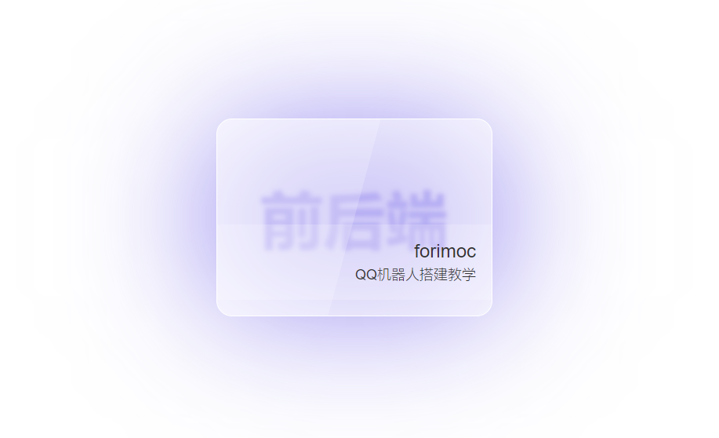

# GlassCard炫彩玻璃态卡片

<u>2022/4/18</u>


## 目的用处

预想是当作其他单页的入口，比如单页博客、CTFd中的题目入口卡片等等


## 参数需求

| 参数   | 说明                                           |
| ------ | ---------------------------------------------- |
| BlogID | 博客ID（配上对应路由，放入href中进行跳转使用） |
| Color  | 卡片炫光颜色，建议与博客类型一致               |
| Tag    | 博客类型（卡片模糊背景字）                     |
| Title  | 博客标题                                       |
| Desc   | 博客描述                                       |
| Author | 博客作者                                       |

## 调用该组件Demo

```json
<template>
  <GlassCard :card_config="card_config"></GlassCard>
</template>

<script>
import GlassCard from "@/components/GlassCard/GlassCard";
export default {
  components: {GlassCard},
  data() {
    return {
      card_config: {
        BlogID: 1,
        Color: 'purple',
        Tag: '前后端',
        Title: 'QQ机器人搭建教学',
        Desc: '前端go-cqhttp原理讲解+实践服务器配置+使用三种语言实现简单Demo',
        Author: 'forimoc',
      }
    }
  }
}
</script>
```

## 效果展示



